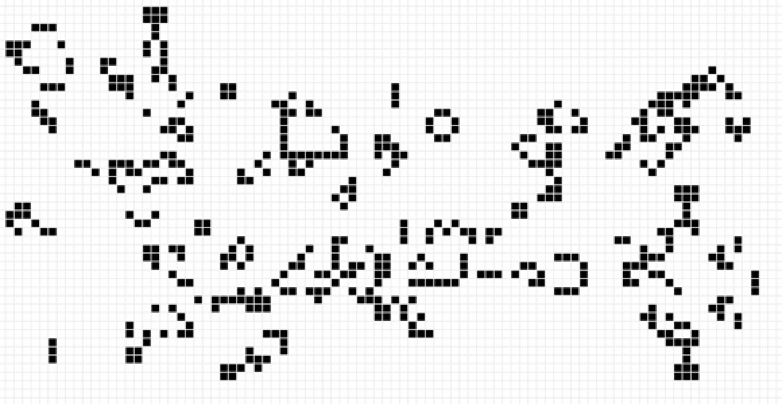

For your first assignment... We make the Game of Life!

 

A still image of the Game of Life

The Game of Life is a simulation originally conceived by the British mathematician J. H. Conway in 1970 and popularized by Martin Gardner in his Scientific American column. The game models the life cycle of bacteria using a two-dimensional grid of cells. Given an initial pattern, the game simulates the birth and death of future generations of cells using a set of simple rules. In this assignment you will implement a simplified version of Conway&#39;s simulation and a basic user interface for watching the bacteria grow over time.

[https://bitstorm.org/gameoflife/](https://bitstorm.org/gameoflife/) (This is where you can play the game and see its effect.)

[https://coderecipe/lifedemo/](https://coderecipe/lifedemo/) (This is where you can download our demo.)

You can create a class for the whole implementation of your Game of Life program.

Your main method should begin by a welcome message. After that, your program should prompt the user for a file name and use that file&#39;s contents to set the initial state of your bacterial colony grid. Then, it should ask if the simulation should wrap around the grid (see below for the details of wrapping). Then the program will allow the user to advance the colony through generations of growth. The user can type **t** to &quot;tick&quot; forward the bacteria simulation by one generation, or **a** to begin an animation loop that ticks forward the simulation by several generations, once every 50 milliseconds; or **q** to quit. Your menu should be case-insensitive; for example, an uppercase or lowercase **A** , **T** , or **Q** should work (hint: you can use the **toLowerCase()** method to convert a string to lowercase).

Note that you can find and copy all the message and prompts in the example files provided.You **must** make use of the **Grid** class provided as you implement your game of life simulation (see the following steps for specific instructions.)

[Example1](http://web.stanford.edu/class/archive/cs/cs106b/cs106b.1186/assnFiles/life/output/expected-output-1.txt)
[Example2](http://web.stanford.edu/class/archive/cs/cs106b/cs106b.1186/assnFiles/life/output/expected-output-2.txt)
[Example3](http://web.stanford.edu/class/archive/cs/cs106b/cs106b.1186/assnFiles/life/output/expected-output-3.txt)
[Example4](http://web.stanford.edu/class/archive/cs/cs106b/cs106b.1186/assnFiles/life/output/expected-output-4.txt)
[Example5](http://web.stanford.edu/class/archive/cs/cs106b/cs106b.1186/assnFiles/life/output/expected-output-5.txt)
[Example6](http://web.stanford.edu/class/archive/cs/cs106b/cs106b.1186/assnFiles/life/output/expected-output-6.txt)
[Example7](http://web.stanford.edu/class/archive/cs/cs106b/cs106b.1186/assnFiles/life/output/expected-output-7.txt)
[Example8](http://web.stanford.edu/class/archive/cs/cs106b/cs106b.1186/assnFiles/life/output/expected-output-8.txt)
[Example9 (tick wrap)](http://web.stanford.edu/class/archive/cs/cs106b/cs106b.1186/assnFiles/life/output/expected-output-9.txt)

## Implementation Using Grid Class

You are supposed to make use of the grid class when you implement your game of life simulation. Your main method should create your grid and pass it to the other methods. A grid object offers a cleaner abstraction of a 2-dimensional data set, with several useful methods and features listed below. Note that you are **NOT** supposed to use all the constructors and methods provided in the grid class.

| Constructors | Description   |
| --- | --- |
| Grid() | Initializes a new empty 0x0 grid. |
| Grid(nRows, nCols) | Initializes a new grid of the given size. |
| Grid(nRows, nCols, value) | Initializes a new grid of the given size, with every call set to the given value. |

| Methods | Description |
| --- | --- |
| equals() | Returns **true** if the two grids contain the same elements |
| set(row, col, value) | Replaces the element at the specified row/col location in this grid with a new value |
| get(row, col) | Returns the element at the specified **row/col** position in this grid |
| height() | Returns the grid&#39;s height, that is, the number of rows in the grid |
| width() | Returns the grid&#39;s width, that is, the number of columns in the grid |
| isEmpty() | Returns **true** if the grid has 0 rows and/or 0 columns |
| inBounds() | Returns **true** if the specified row and column position is inside the bounds of the grid. |
| resize(nRows, nCols) | Reinitializes the grid to have the specified number of rows and columns |
| fill(value) | Sets every grid element to the given value |
| size() | Returns the total number of elements in the grid |
| toString() | Converts the grid to a printable single-line string representation |
| toString2D() | Converts the grid to a printable 2-D string representation |

NOTE: resize method has three parameters, the last of which is a Boolean named _retain_ indicating whether or not you want to retain the old data in the grid. For example, if you have a grid of 4x4, and want to resize it to 6x6 at the same time retaining the original data. You can set _retain_ to be true. There is no toString2D() method, neither is there a mapAll(fn) method.
