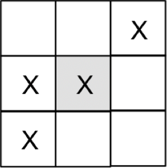

 

Each grid location is either empty or occupied by a single living cell (X). In the example on the right, the shaded middle location has three neighbors containing living cells. A square that is on the border of the grid has fewer than eight neighbors in the non-wrapping version of the simulation (see below for the wrapping version). For example, the top-right X square in the example at right has only three neighboring squares, and only one of them contains a living cell (the shaded square), so it has one living neighbor.