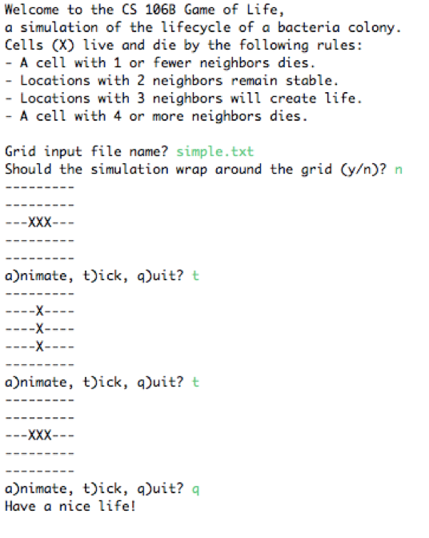

After getting down with the method of counting a cell&#39;s neighbors, we can move forward to the next stage of the simulation. In this part, you should implement a method called **tickToNext()**to advance the grid to its next generation. You can pass a boolean parameter called **wrapping** into this method to specify the mode (wrapping or non-wrapping) i.e. the method being called to count the number of neighbors of each cell. Note that we have not implemented the wrapping mode yet, so you can temporarily leave the case of calling that method blank.

Game of Life Simulation Rules:

The simulation starts with an initial pattern of cells on the grid and computes successive generations of cells according to the following rules:

1. A location that has zero or one neighbors will be empty in the next generation. If a cell was there, it dies.
2. A location with two neighbors is stable. If it had a cell, it still contains a cell. If it was empty, it&#39;s still empty.
3. A location with three neighbors will contain a cell in the next generation. If it was unoccupied before, a new cell is born. If it currently contains a cell, the cell remains.
4. A location that has four or more neighbors will be empty in the next generation. If a cell was there, it dies.

The births and deaths that transform one generation to the next all take effect simultaneously. When you are computing a new generation, new births/deaths in that generation don&#39;t impact other cells in that generation. Any changes (births or deaths) in a given generation k start to have effect on other neighboring cells in generation **k+1**.

Check your understanding of the game rules by looking at the following example. The two patterns should alternate forever:

 

Here is a second example. The pattern at right does not change on each iteration, because each cell has exactly three living neighbors. This is called a &quot;stable&quot; pattern or a &quot;still life&quot;.

 

When you are trying to update the bacteria from one generation to the next, you cannot do this &quot;in place&quot; by modifying your grid as you loop over it. Doing so will change the cells and their neighbors and break the neighbor counts for nearby cells. So, you will need to create a temporary second grid. Your existing grid represents the current generation of bacteria, and you can create a temporary second grid that allows you to compute and store the next generation without changing the current one. Once you have filled the second grid with the next generation&#39;s cell information, you can copy its contents back into the original grid and discard the temporary copy.

Simple Example:

Here is an example of the interaction between your program and the user (with console input in blue). The file of this example **simple.txt** is provided along with all the examples in the folder called &quot;file&quot;. Note that when displaying the grid, you should **NOT** use **toString()** provided in the grid class. Instead, you can have another method called **printGrid()** to print out the grid as what is like below (the grid display should contains only &#39;-&#39; and &#39;X&#39;.)

 