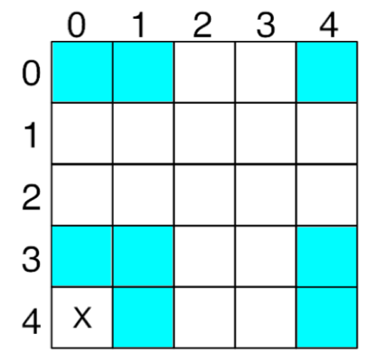

The non-wrapping version of the assignment we just implemented treats the edges of the grid as the end of the game world. Cells on the border do not always have eight neighbors. In the wrapping version, all cells will have eight neighbors, as follows: the right-most squares are considered to be &quot;neighbors&quot; of the left-most, and the top-most are considered to be &quot;neighbors&quot; of the bottom- most. In order to provide wrapping functionality, modify your game logic so that these rules are followed. This will allow moving patterns such as &quot;gliders&quot; to wrap around indefinitely. To implement this part of the simulation, you need to write a method called **numOfNeighborWrap()**  to count and return the number of neighbors of each cell in a wrapping mode.

The logic for this is not too difficult, and here is one suggested way for you to implement this logic by using the remainder operator ( **%** ) to perform part of this task. You are also welcomed to use other ways of implementation. The remainder function works as follows:

**(a % b) returns the remainder of a / b**
For positive values, the operator returns the value of the remainder, which &quot;wraps&quot; around to the value. E.g., 6%5 = 1, which would be correctly wrapped on a grid from 0-4 (which has 5 values).

For negative values, the remainder function does not wrap in Java, but wrapping can be accomplished by simply adding the number of rows or columns in the grid to the negative value. In fact, to wrap properly in all cases, simply add the number of rows or columns to the location, and then apply the remainder operator.

For example, let&#39;s say you were checking the bottom left corner of a 5x5 grid (with indexes 0-4 for both the rows and columns), at location (4,0), as shown in the diagram below.

 

The blue squares show the neighbors with wrapping and going clockwise from the top-left corner of the neighbors, would be at locations (3, -1), (3, 0), (3, 1), (4, -1), (4, 1), (5, -1), (5, 0), and (5, 1). But, both the negative values and the values above 4 are out of bounds. If we apply the remainder operator as detailed above, we will get a proper wrapping of the values. If we add the corresponding number of rows or columns (5 in this case, for both), and then apply the remainder operator with the same value to each of the coordinate pairs, we will get a proper wrap. Using coordinate (5, -1) as an example, this would become:

**((5 + 5) % 5, (-1 + 5) % 5) = (10 % 5, 4 % 5) = (0, 4)**

and that coordinate is properly wrapped to the top right corner.

Many of the provided colonies will behave differently with and without wrapping. For instance, without wrapping, the glider colony will move to the bottom of the screen in a straight line and stop. With wrapping, the glider colony will move to the bottom of the screen and continue wrapping around and moving forever in a straight line.